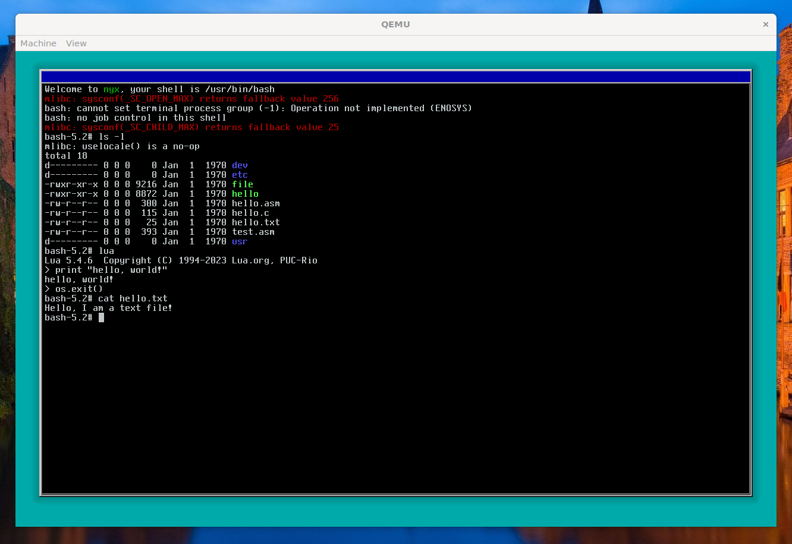

# Nyx

Nyx is a hobby OS powered by its own kernel, [Gaia](https://github.com/nyx-org/gaia).

## Screenshot

## Running

`meson setup build --cross-file toolchains/x86_64-llvm.ini && ninja -C build && ./jinx build-all && ARCH=x86_64 ./run.sh`